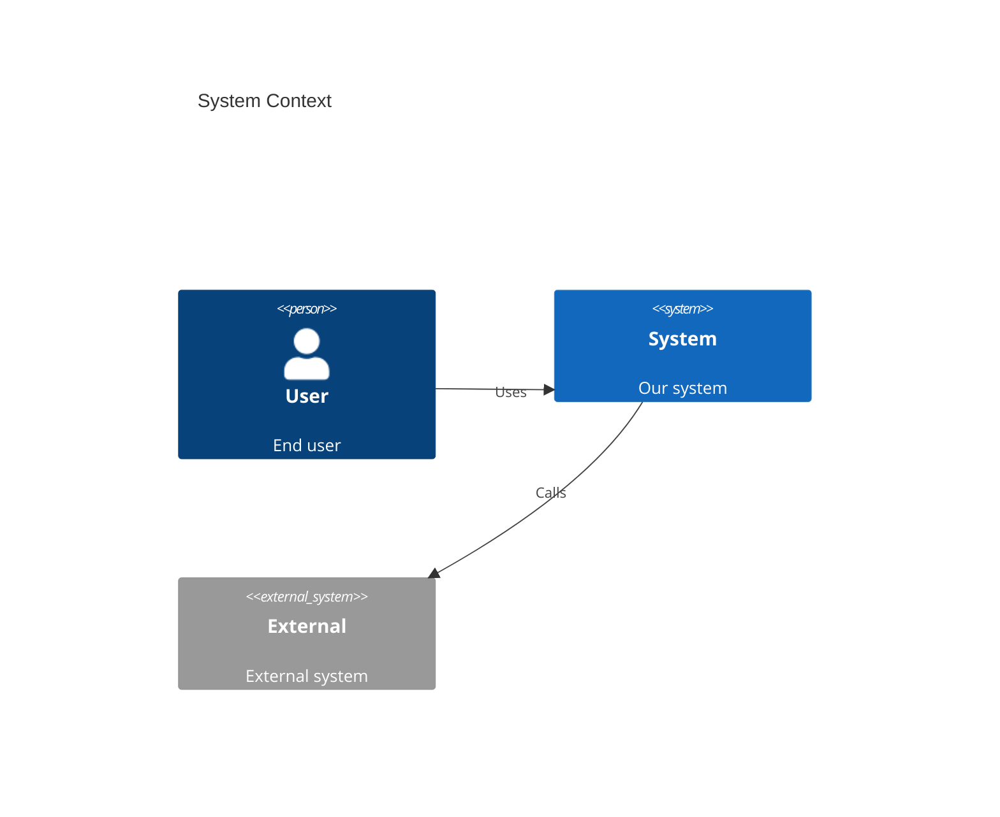
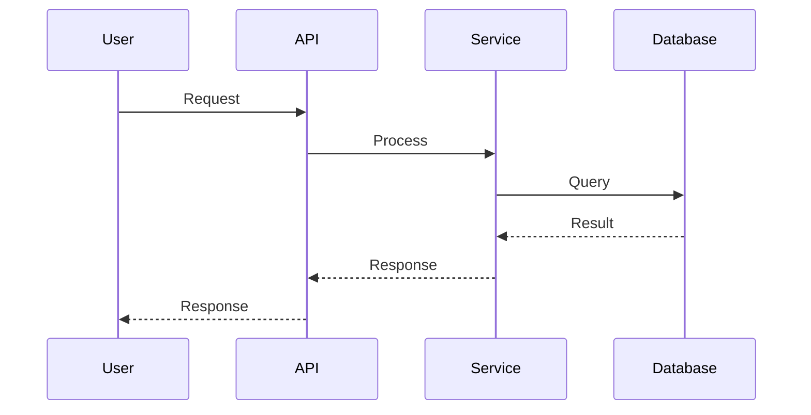

# Architecture Diagrams

## Purpose

Visual diagrams for system architecture.

## Diagram Types

| Type | Tool | Description |
|------|------|-------------|
| C4 Context | Mermaid/PlantUML | System context |
| C4 Container | Mermaid/PlantUML | Containers/services |
| C4 Component | Mermaid/PlantUML | Components |
| Sequence | Mermaid | Interactions |
| ER | Mermaid | Data model |
| Flowchart | Mermaid | Processes |

## Mermaid Examples

### C4 Context

### Sequence

## Files

| File | Description |
|------|-------------|
| - | No diagrams yet |

## Creating Diagrams

Use `/diagram` or include in architecture document.
