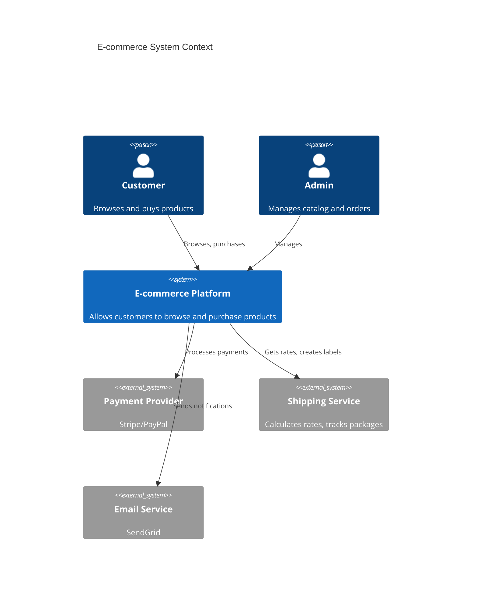
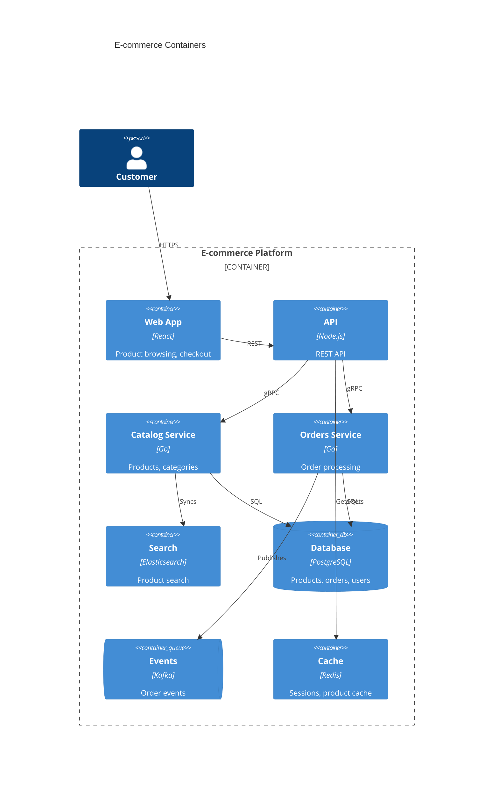
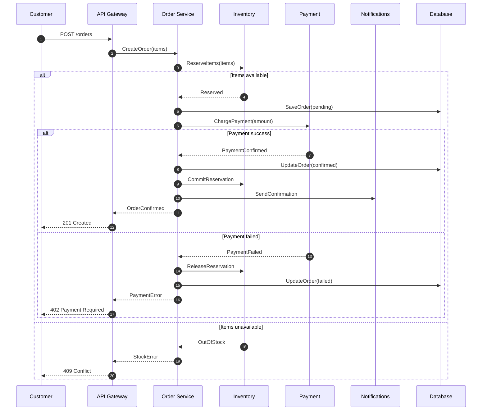
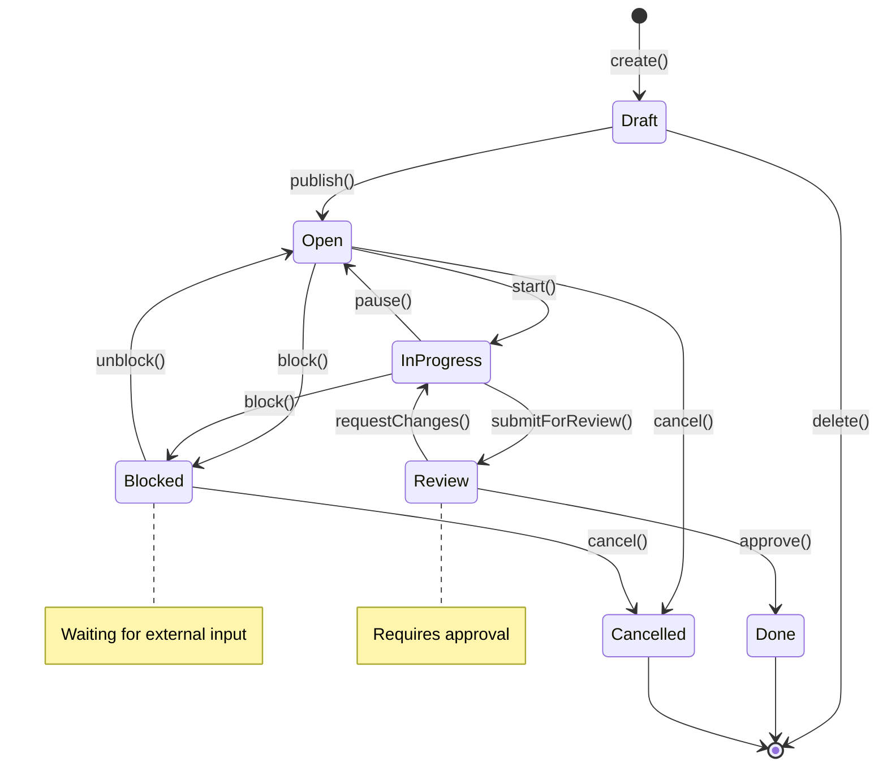
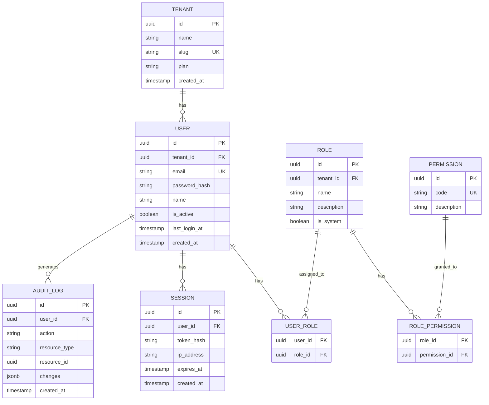

# Diagram Templates

Load this when writing a diagram file. Copy the block for the type you need, then fill the placeholders. Every diagram file has the same three parts: a one-line statement of what it shows, the diagram body, and a table explaining elements and relationships.

`{DOCS_ROOT}` defaults to `docs/` at the project root.

---

## C4 Context (Mermaid)

```markdown
# System Context Diagram

## Overview
[What this diagram shows]

## Diagram

\`\`\`mermaid
C4Context
    title System Context Diagram for [System Name]

    Person(user, "User", "Description")
    System(system, "System Name", "Description")
    System_Ext(ext1, "External System", "Description")

    Rel(user, system, "Uses")
    Rel(system, ext1, "Integrates with")
\`\`\`

## Elements

| Element | Type | Description |
|---------|------|-------------|
| User | Person | ... |

## Relationships

| From | To | Description |
|------|-----|-------------|
```

## C4 Container

```markdown
# Container Diagram

\`\`\`mermaid
C4Container
    title Container Diagram for [System Name]

    Person(user, "User")

    Container_Boundary(system, "System Name") {
        Container(api, "API Gateway", "Go", "Routes requests")
        Container(svc1, "Service 1", "Go", "Handles X")
        ContainerDb(db, "Database", "PostgreSQL", "Stores data")
        ContainerQueue(queue, "Message Queue", "Kafka", "Events")
    }

    Rel(user, api, "HTTPS")
    Rel(api, svc1, "gRPC")
    Rel(svc1, db, "SQL")
    Rel(svc1, queue, "Publishes")
\`\`\`
```

## C4 Component

```markdown
# [Service Name] Component Diagram

## Overview
Internal structure of [Service Name] container.

## Diagram

\`\`\`mermaid
C4Component
    title Component Diagram for [Service Name]

    Container_Boundary(svc, "[Service Name]") {
        Component(ctrl, "API Controller", "Go", "HTTP handlers")
        Component(usecase, "Use Cases", "Go", "Business logic orchestration")
        Component(domain, "Domain", "Go", "Core business rules")
        Component(repo, "Repository", "Go", "Data access")
    }

    ContainerDb(db, "Database", "PostgreSQL")
    Container(queue, "Message Queue", "Kafka")

    Rel(ctrl, usecase, "Calls")
    Rel(usecase, domain, "Uses")
    Rel(usecase, repo, "Persists via")
    Rel(repo, db, "SQL")
    Rel(usecase, queue, "Publishes events")
\`\`\`

## Components

| Component | Responsibility | Dependencies |
|-----------|---------------|--------------|
| API Controller | HTTP routing, validation | Use Cases |
| Use Cases | Orchestration, transactions | Domain, Repository |
| Domain | Business rules, entities | None (pure) |
| Repository | Data persistence | Database |

## Patterns Used

- [Project's chosen architecture pattern]
- Dependency injection
- Repository pattern
```

## C4 with ASCII (fallback)

Use ASCII only when the target renderer cannot show Mermaid C4.

```markdown
# System Context (ASCII)

\`\`\`
                         ┌─────────────┐
                         │   Admin     │
                         │   (Person)  │
                         └──────┬──────┘
                                │ manages
                                ▼
┌─────────────┐          ┌─────────────┐          ┌─────────────┐
│  Customer   │─────────►│   System    │─────────►│  Payment    │
│  (Person)   │  uses    │             │  calls   │  Gateway    │
└─────────────┘          └─────────────┘          │  (External) │
                                │                  └─────────────┘
                                │ sends
                                ▼
                         ┌─────────────┐
                         │   Email     │
                         │  (External) │
                         └─────────────┘
\`\`\`

Legend:
- Box = System/Person
- Arrow = Relationship
- (External) = Outside our control
```

## Sequence

```markdown
# [Flow Name] Sequence

## Context
[When this flow occurs]

## Diagram

\`\`\`mermaid
sequenceDiagram
    autonumber
    participant U as User
    participant A as API
    participant S as Service
    participant D as Database

    U->>A: Request
    A->>S: Process
    S->>D: Query
    D-->>S: Result
    S-->>A: Response
    A-->>U: Result

    Note over S,D: Transaction boundary
\`\`\`

## Steps

1. **Request**: User sends...
2. **Process**: Service validates...

## Error Scenarios

[What happens on failure]
```

## ER Diagram

```markdown
# [Domain] Entity Relationship Diagram

\`\`\`mermaid
erDiagram
    MERCHANT ||--o{ PRODUCT : owns
    PRODUCT ||--|{ OFFER : has
    PRODUCT }o--|| CATEGORY : belongs_to

    MERCHANT {
        uuid id PK
        string name
        string status
        timestamp created_at
    }

    PRODUCT {
        uuid id PK
        uuid merchant_id FK
        string sku
        string name
    }

    OFFER {
        uuid id PK
        uuid product_id FK
        decimal price
        int quantity
    }
\`\`\`

## Entities

### MERCHANT
[Description and business rules]

### PRODUCT
[Description and business rules]
```

## Flowchart

```markdown
# [Process Name] Flow

\`\`\`mermaid
flowchart TD
    A[Start] --> B{Condition?}
    B -->|Yes| C[Action 1]
    B -->|No| D[Action 2]
    C --> E[End]
    D --> E

    style A fill:#f9f
    style E fill:#9f9
\`\`\`

## Decision Points

| Point | Condition | Yes Path | No Path |
|-------|-----------|----------|---------|
```

## State Diagram

```markdown
# [Entity] State Machine

\`\`\`mermaid
stateDiagram-v2
    [*] --> Draft
    Draft --> Pending: submit()
    Pending --> Approved: approve()
    Pending --> Rejected: reject()
    Approved --> Active: activate()
    Active --> Suspended: suspend()
    Suspended --> Active: resume()
    Rejected --> [*]
    Active --> [*]: close()
\`\`\`

## States

| State | Description | Allowed Transitions |
|-------|-------------|---------------------|
| Draft | Initial state | submit |
```

## Diagram Index (README.md)

```markdown
# Diagrams Index

## Architecture Diagrams

| Diagram | Level | Description |
|---------|-------|-------------|
| [System Context](./c4/system-context.md) | C4-L1 | High-level system view |
| [Containers](./c4/containers.md) | C4-L2 | Service boundaries |

## Sequence Diagrams

| Flow | Description |
|------|-------------|
| [User Registration](./sequences/user-registration.md) | ... |

## Data Diagrams

| Diagram | Scope |
|---------|-------|
| [Overview ERD](./data/erd-overview.md) | All domains |

## Process Flows

| Process | Description |
|---------|-------------|
```

---

## Worked examples

### Example 1: E-commerce system (C4 Context → Container)

**Context:**



**Container:**



### Example 2: Order processing (Sequence)



### Example 3: Task entity (State diagram)



**State transition table:**

| From | To | Trigger | Conditions |
|------|-----|---------|------------|
| Draft | Open | publish() | Has title, assignee |
| Open | InProgress | start() | Assignee available |
| InProgress | Review | submitForReview() | All subtasks done |
| Review | Done | approve() | Reviewer approved |
| Review | InProgress | requestChanges() | Changes requested |
| Any | Blocked | block() | External dependency |
| Blocked | Previous | unblock() | Dependency resolved |

### Example 4: User domain (ER diagram)



---

## Common mistakes

| Mistake | Problem | Fix |
|---------|---------|-----|
| Too much detail in Context | Overwhelming, loses purpose | Only external systems and actors |
| Mixing abstraction levels | Confusing, inconsistent | One C4 level per diagram |
| No legend | Reader guesses meaning | Always include a legend for colors/shapes |
| Outdated diagrams | Misleading | Update with code changes, review in PRs |
| Sequence too long | Unreadable | Split into multiple diagrams by scenario |
| ER with all fields | Cluttered | Show only key fields, document the rest separately |
